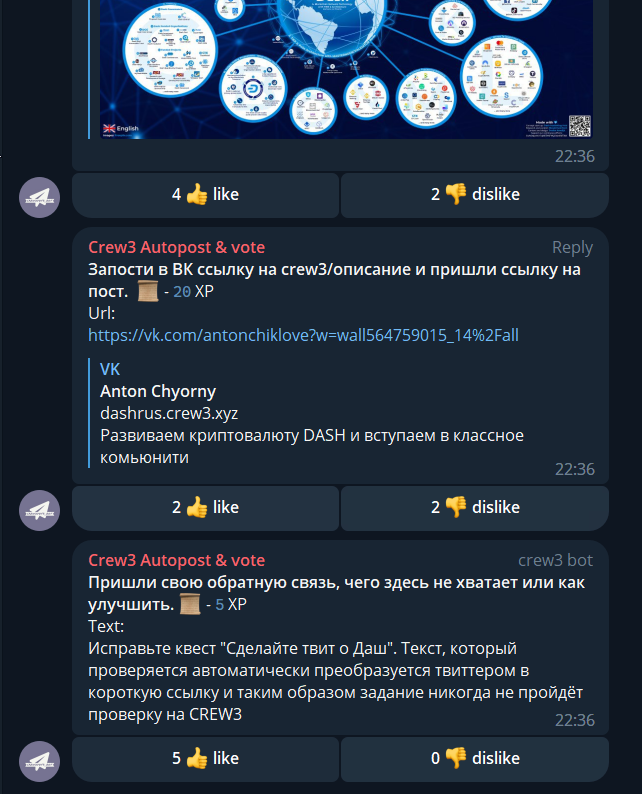
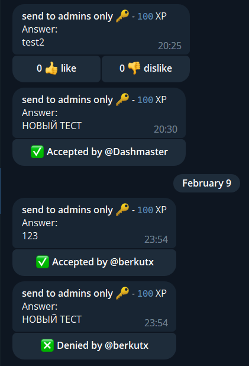

# @crew3vote_bot
Repost claimed quest from crew3 to telegram group. Community vote or admin approval

### Features:
1) Auto post claimed to telegram-group and vote by community

2) Approve claims from bot(for quests with 🔑 in name)

3) Show who clicked on likes\dislikes
4) Add\Remove XP from bot
5) Transfer XP from one user to another

### Crew3 setup:
Add to the topic 🔑 for send claims(with answers) to admins. Or add 📜 for vote.

(optional):
add bind-to-telegram quest, where users can enter usernames(started with @)

### Bot Setup:

minimal setup:  
0) find bot in telegram: @crew3vote_bot
1) Click `Start` in DM\PM of bot
2) Add **@crew3vote_bot** to the group as admin **without** privileges
3) In Group, enter  
`/configure@crew3vote_bot admins:@admin1,@admin2 likesToApprove:10`

4) `/initcrew3here@crew3vote_bot communitySubdomainFromCrew3URL`
5) Return to Crew3 and get **apiKey**, go to PM with bot and follow the instruction.
6) Enter in group next command to activate admin-mode for 🔑-quests:  
`/sendMeOtherClaimsToApproveAsAdmin@crew3vote_bot`

### self-hosted bot:
0. Get BotToken from telegram https://t.me/BotFather
1. npm install
2. export BOT_TOKEN=****
3. node telegramMonitorBot.js